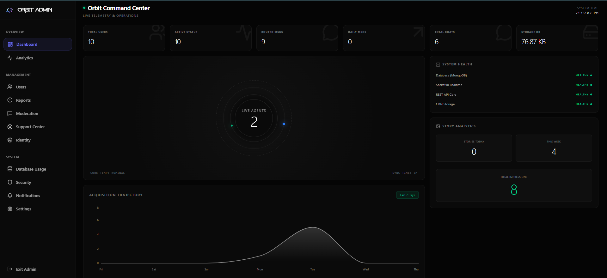
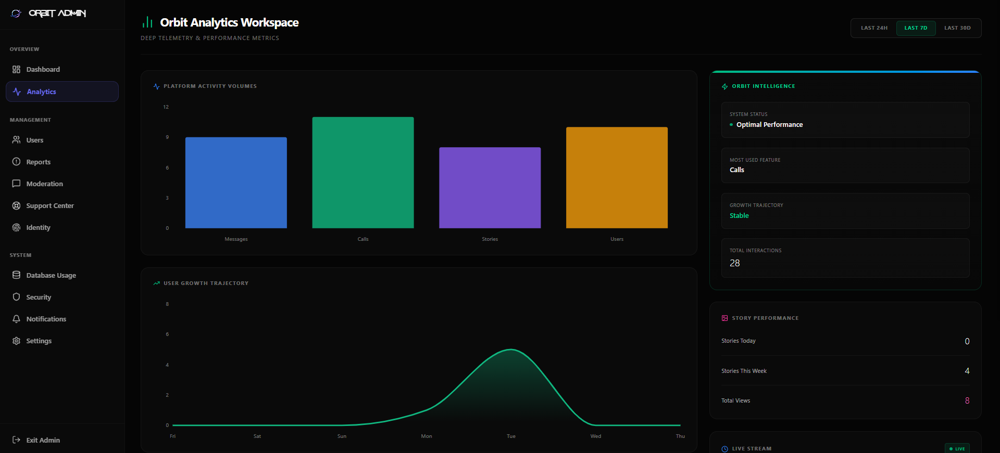

<div align="center">
  
  <h1>Orbit Messenger</h1>
  <p><strong>Enterprise-Grade Secure Communications Platform</strong></p>

  <p>
    <a href="https://orbitmessenger.netlify.app/"><strong>Live Demo</strong></a> • 
    <a href="https://github.com/Jayanth0124/chat-app"><strong>GitHub Repository</strong></a>
  </p>

  [](https://opensource.org/licenses/MIT)
  [](https://reactjs.org/)
  [](https://nodejs.org/)
  [](https://socket.io/)
  [](https://www.mongodb.com/)
  [](https://developer.mozilla.org/en-US/docs/Web/Progressive_web_apps)
</div>

<br />

## 🪐 Orbit Overview
Orbit is a next-generation, privacy-first communication platform designed to offer an ultra-premium messaging experience. Built from the ground up to support real-time data flow, Orbit seamlessly integrates high-fidelity text, voice, and video interactions within a breathtaking glassmorphic UI. 

### Product Vision & Core Philosophy
Our vision is simple: **Uncompromised Communication**. 
We believe that enterprise-grade security and luxurious user experiences are not mutually exclusive. Orbit abandons the generic, utilitarian aesthetics of traditional SaaS platforms in favor of a fluid, cinematic interface. Every micro-interaction is designed to feel tactile, responsive, and secure.

---

## 📸 Interface Preview
- **Executive Security Dashboard**: 
  <br/>
  

- **Platform Analytics**:
  <br/>
  

---

## ⚡ Key Features

### 💬 Advanced Messaging System
- **Real-Time Delivery**: Sub-millisecond message routing powered by WebSockets.
- **Read Receipts & Presence**: Live "Typing..." indicators and instant delivery/read confirmations.
- **Rich Media Support**: Drag-and-drop support for images and documents.
- **Audio Notes**: In-browser voice recording with custom waveform playback.

### 🎥 High-Fidelity Audio & Video 
- **WebRTC Integration**: Peer-to-peer, low-latency encrypted audio and video calling.
- **Picture-in-Picture (PiP)**: Seamlessly multitask within the app while maintaining visual contact.
- **Call History**: Automated logging of all incoming, outgoing, and missed communications.

### 👻 Privacy & Security Features
- **Vanish Mode**: Ephemeral messaging capabilities. Messages self-destruct from the database and UI once read.
- **Message Unsend**: Complete retraction capabilities with real-time DOM synchronization across all participants.
- **End-to-End Security Philosophy**: Passwords are mathematically hashed, and strict JWT lifecycle rules manage session validity.

### 🤝 Orbit Connection System
- **Curated Social Graph**: Move beyond traditional contact lists. Send, accept, or decline Orbit Connections to build your secure network.
- **Granular Blocking**: Instantly sever connections and block endpoints to maintain absolute privacy.

### 📱 Progressive Web App (PWA)
- **Native Experience**: Install Orbit directly to your iOS or Android home screen.
- **Push Notifications**: Receive native OS-level alerts for incoming calls and messages, even when the browser is closed via Service Workers.

### 🛡️ Executive Admin Dashboard
- **Telemetry & Analytics**: Real-time insights into platform usage, active connections, and database volume.
- **Moderation Tools**: Authoritative controls to suspend, ban, or restrict abusive endpoints.
- **System Broadcasts**: Push global platform announcements to all active sockets instantly.

---

## 🛠️ Technology Stack

| Layer | Technology |
| :--- | :--- |
| **Frontend** | React 18, Vite, Zustand (State), Framer Motion, Tailwind CSS |
| **Backend** | Node.js, Express.js |
| **Database** | MongoDB (Mongoose ODM) |
| **Real-Time** | Socket.IO, WebRTC (Simple-Peer) |
| **Media Storage** | Cloudinary |
| **Authentication** | JWT, bcrypt |

---

## 🚀 Installation & Environment Setup

### Prerequisites
- Node.js (v18 or higher)
- MongoDB Cluster (Atlas or Local)
- Cloudinary Account
- Web Push VAPID Keys

### Setup Instructions

1. **Clone the repository**
   ```bash
   git clone https://github.com/Jayanth0124/chat-app.git
   cd chat-app
   ```

2. **Backend Configuration**
   ```bash
   cd backend
   npm install
   ```
   Create a `.env` file in the `backend` directory:
   ```env
   PORT=5000
   MONGODB_URI=your_mongodb_connection_string
   JWT_SECRET=your_ultra_secure_jwt_secret
   NODE_ENV=development
   
   CLOUDINARY_CLOUD_NAME=your_cloud_name
   CLOUDINARY_API_KEY=your_api_key
   CLOUDINARY_API_SECRET=your_api_secret
   
   VAPID_PUBLIC_KEY=your_vapid_public_key
   VAPID_PRIVATE_KEY=your_vapid_private_key
   ```

3. **Frontend Configuration**
   ```bash
   cd ../frontend
   npm install
   ```
   Create a `.env` file in the `frontend` directory:
   ```env
   VITE_API_URL=http://localhost:5000/api
   VITE_SOCKET_URL=http://localhost:5000
   VITE_VAPID_PUBLIC_KEY=your_vapid_public_key
   ```

4. **Run the Application**
   Open two terminal windows:
   - Terminal 1 (Backend): `cd backend && npm run dev`
   - Terminal 2 (Frontend): `cd frontend && npm run dev`

---

## 🌐 Deployment Strategy

Orbit is designed to be completely stateless at the API level.
- **Frontend**: Optimized for edge deployment on platforms like Vercel, Netlify, or AWS Amplify.
- **Backend**: Container-ready for deployment on Render, Heroku, or AWS ECS. *Note: Ensure your hosting provider supports WebSocket persistent connections.*
- **Database**: MongoDB Atlas is highly recommended for production stability and automated backups.

---

## 🗺️ Future Roadmap

- [ ] **End-to-End Encryption (E2EE)**: Implementing Signal Protocol logic for absolute message secrecy.
- [ ] **Group Orbits**: Expanding the chat architecture to support multi-user channels and group video conferences.
- [ ] **Desktop Native Apps**: Wrapping the PWA into Electron/Tauri for native Windows and macOS applications.
- [ ] **File System Upgrades**: Increasing attachment limits and adding in-app document previewers.

---

## 🤝 Contributing
Orbit is an ambitious project, and the codebase is open for improvements. 
**Calling all developers!** We highly encourage you to review the codebase, find issues, optimize performance, and submit Pull Requests. Whether it's a minor CSS tweak, a database indexing optimization, or a major feature addition—your contributions are welcome.

1. Fork the Project
2. Create your Feature Branch (`git checkout -b feature/AmazingFeature`)
3. Commit your Changes (`git commit -m 'Add some AmazingFeature'`)
4. Push to the Branch (`git push origin feature/AmazingFeature`)
5. Open a Pull Request

---

## 👨‍💻 Credits & Branding

Orbit is proudly architected and designed by:

**Developer**: Donavalli Jayanth  
**Portfolio**: [djayanth.site](https://djayanth.site)  
**GitHub**: [@Jayanth0124](https://github.com/Jayanth0124)  

---
<div align="center">
  <sub>Built with passion for seamless communication.</sub>
</div>
